  

<h1 align="center">Hola, soy Pablo 👋</h1>

  <b>Administrador de Sistemas</b> · infraestructura, virtualización y automatización. 
  Me gusta documentar lo que rompo y arreglo — y lo comparto en mi wiki.

  

---

### ⚙️ Con lo que trabajo

### 📓 Mi wiki técnica

Documento procedimientos reales de administración de sistemas: Zabbix, Proxmox, rclone, systemd, Plesk, redes… y además tiene un **terminal interactivo** que consulta la propia wiki y responde con una IA local.

> 🔗 **[wiki.pablogg.dev](https://wiki.pablogg.dev)** — abre el terminal (botón `>_` abajo a la derecha) y escribe `help`, `ls`, o `ask lo que quieras`.

### 📊 Actividad

  
  

  
  

